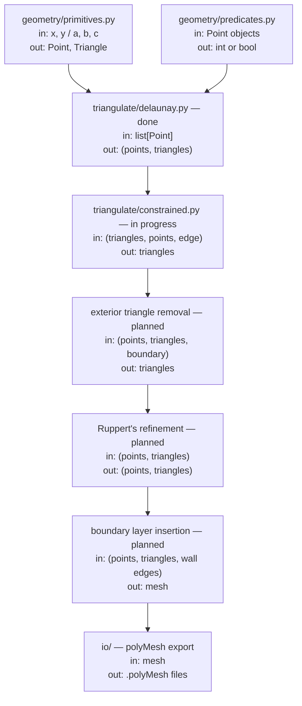

# Architecture

```mermaid
flowchart TD
    A["geometry/primitives.py<br/>in: x, y / a, b, c<br/>out: Point, Triangle"] --> C
    B["geometry/predicates.py<br/>in: Point objects<br/>out: int or bool"] --> C
    C["triangulate/delaunay.py — done<br/>in: list[Point]<br/>out: (points, triangles)"] --> D
    D["triangulate/constrained.py — in progress<br/>in: (triangles, points, edge)<br/>out: triangles"] --> E
    E["exterior triangle removal — planned<br/>in: (points, triangles, boundary)<br/>out: triangles"] --> F
    F["Ruppert's refinement — planned<br/>in: (points, triangles)<br/>out: (points, triangles)"] --> G
    G["boundary layer insertion — planned<br/>in: (points, triangles, wall edges)<br/>out: mesh"] --> H
    H["io/ — polyMesh export<br/>in: mesh<br/>out: .polyMesh files"]
```
